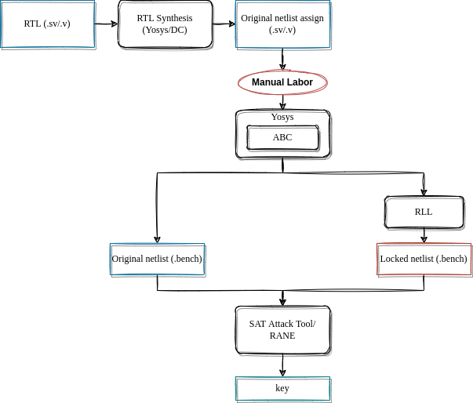

# General

This repository performs a **SAT-based attack** on locked open-source designs: (1) modules from the RISC-V Ariane core and (2) modules from an AES core. The attacks are executed using two open-source tools: (1) the original SAT-based attack tool and (2) the RANE tool.

# External repositories

## Open-source designs
* [RISC-V Ariane](https://github.com/lowRISC/ariane)
* [AES](http://www.opencores.org/cores/aes_core/)

## Open-source SAT-based attack tools
* Original SAT-based attack
This attack was first described in 2015 in the paper [Evaluating the Security of Logic Encryption Algorithms](https://ieeexplore.ieee.org/document/7140252)
The repository and further installation steps can be found [here](https://host15author@bitbucket.org/host15author/host15-logic-decryption).
* RANE
The RANE tool is described in the paper[RANE: An Open-Source Formal De-obfuscation Attack for Reverse Engineering of Logic Encrypted Circuits](https://dl.acm.org/doi/10.1145/3453688.3461760)
The repository and further installation steps can be found [here](https://github.com/gate-lab/RANE).

## Additional tools for synthesis
* Yosys
The repository and further installation steps can be found [here](https://github.com/YosysHQ/yosys).
* Synopsys DC (optional)
Commercial tool

# Directory structure
The logic locking is performed only on several combinational modules from both Ariane and AES.

## Benchmarks
The designs to be (un-)locked are separated in two folders, `benmchmarks\ariane` and `benmchmarks\aes`.
The directory structure in both designs is the same.
* The RTL file being locked is in the folder `1_rtl_orig`
* The synthesized netlist in assignment format is stored inn `2_assign_orig`. Depending on the tool used, all the consecutive files are stored either in `yosys` or `dc` subfolder.
* The netlist in `bench` format is stored in `3_bench_orig`
* The locked netlist as well as the results from the unlocking are stored in `4_bench_obf`

## Scripts
The main script is `scripts/attackFlow.sh`. All the steps are documented there. The additional files are in the same `script` folder.

# Attack flow
The script `scripts/attackFlow.sh` executes all the necessary steps to perform the SAT-based locking and attack.

The general flow is shown in the following Figure:

Let's take the `aes_sbox` module as an example, synthesized with Yosys.
The original design is located in `benchmarks/aes/1_rtl_orig/aes_sbox.v`.

## Disclaimer
While performing the (un-)locking with both tools (original SAT and RANE), some manual changes had to be performed on the files in different formats in order for the attacks to succeed.
The scripts contain additional comments.

## Synthesys
Before the modules can be locked, they have to be synthesized first.
The SAT-attack tool excepts netlists in `bench` format.
RANE tool can work with neltislt `bench` as well as in `verilog` format, however, this flow cover only the `bench` format, since that is the only output from the SAT-based tool.

### Yosys
The synthesys with Yosys is done using the `yosys.tcl`
The synthesized netlist is in assignment format in `benchmarks/aes/2_assign_orig/yosys/aes_sbox.v`.
See the script for additional comments.

### Synopsys DC
The synthesys with Yosys is done using the `dc.tcl`
The synthesized netlist is in assignment format.

## Conversion to `bench`
**Yosys/ABC** is used to do the conversion from verilog assignment format to `blif` to `bench`.
The original netlist is in `benchmarks/aes/3_bench_orig/yosys/aes_sbox.bench`

## Logic Locking
The logic locking is executed with the SAT-based attack tool.
It can perform Random Logic Locking (RLL) as well as Strong Logic Locking (SLL) with configurable *key-input* sizes.
The encrypted output netlist is in `benchmarks/aes/4_bench_obf/yosys/aes_sbox.bench`.

(!) The RLL using the RANE tool did not work due to missing files in the repository.

## SAT-based attack
The SAT-based attack produces an output stored in `benchmarks/aes/4_bench_obf/yosys/statistics.txt`.
If the attack is successful, it shows the key, the number of DIPs as well as the time needed for unlocking.
(!) Unlocking with RANE must be done with additional modifications to the signal names as described in `scripts/attackFlow.sh`.
=======
# SAT-LL
SAT-based attacks on RLL
